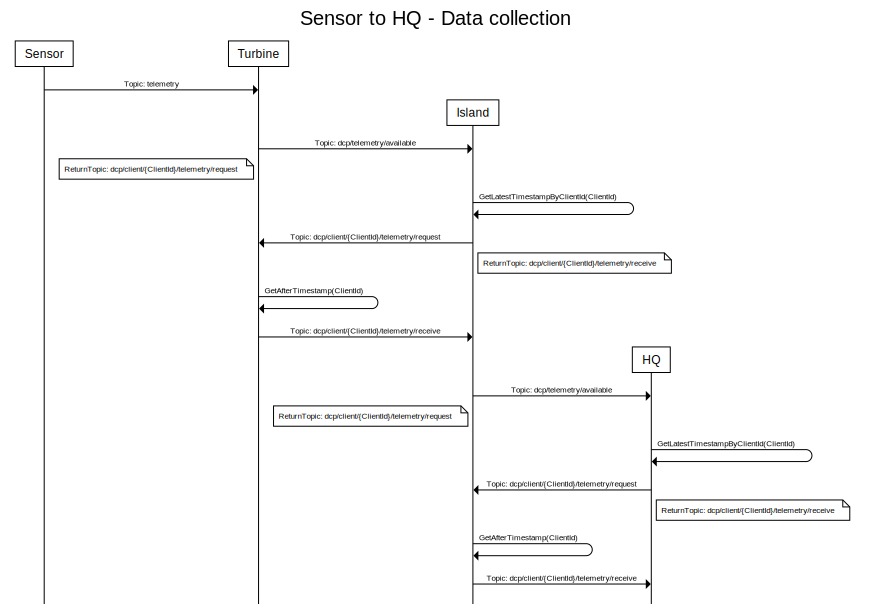
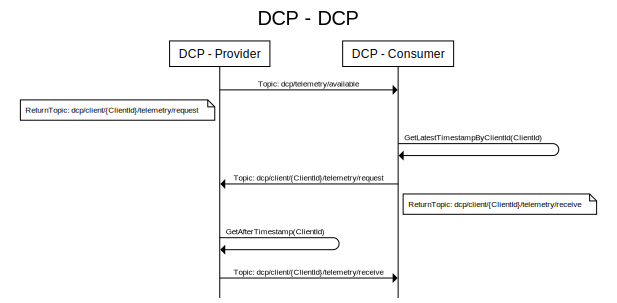

# OMA-DCP
Data Collection Point application

## Sensor to HQ Synchronization
The communication uses QOS "1".



SVG sequence diagram tool: https://github.com/davidje13/SequenceDiagram/

<details> 
<summary>SVG code - <a href="https://sequence.davidje13.com/">Sequence Diagram</a></summary>

```
title Sensor to HQ - Data collection

Sensor -> Turbine: Topic: telemetry

Turbine -> Island: Topic: dcp/telemetry/available
note left of Turbine, Turbine: ReturnTopic: dcp/client/{ClientId}/telemetry/request
Island -> Island: GetLatestTimestampByClientId(ClientId)
Island -> Turbine: Topic: dcp/client/{ClientId}/telemetry/request
note right of Turbine, Island: ReturnTopic: dcp/client/{ClientId}/telemetry/receive
Turbine -> Turbine: GetAfterTimestamp(ClientId)
Turbine -> Island: Topic: dcp/client/{ClientId}/telemetry/receive

Island -> HQ: Topic: dcp/telemetry/available
note left of Island, HQ: ReturnTopic: dcp/client/{ClientId}/telemetry/request
HQ -> HQ: GetLatestTimestampByClientId(ClientId)
HQ -> Island: Topic: dcp/client/{ClientId}/telemetry/request
note right of Island, HQ: ReturnTopic: dcp/client/{ClientId}/telemetry/receive
Island -> Island: GetAfterTimestamp(ClientId)
Island -> HQ: Topic: dcp/client/{ClientId}/telemetry/receive
```
</details> 

## DCP to DCP synchronization

The communication between the DCP instanses, uses QoS "1", we could have gone with all 3 of the levels, because a loss or duplication of a message, will not have any impact on the databases, it's only the network that will see the differencs in packages.

Because the application is resilient for data dupication, we do not need to worry about that, and could just have gone with QoS "0".



SVG sequence diagram tool: https://github.com/davidje13/SequenceDiagram/

<details> 
<summary>SVG code - <a href="https://sequence.davidje13.com/">Sequence Diagram</a></summary>

```
title DCP - DCP

DCP - Provider -> DCP - Consumer: Topic: dcp/telemetry/available
note left of DCP - Provider, DCP - Consumer: ReturnTopic: dcp/client/{ClientId}/telemetry/request
DCP - Consumer -> DCP - Consumer: GetLatestTimestampByClientId(ClientId)
DCP - Consumer -> DCP - Provider: Topic: dcp/client/{ClientId}/telemetry/request
note right of DCP - Provider, DCP - Consumer: ReturnTopic: dcp/client/{ClientId}/telemetry/receive
DCP - Provider -> DCP - Provider: GetAfterTimestamp(ClientId)
DCP - Provider -> DCP - Consumer: Topic: dcp/client/{ClientId}/telemetry/receive
```
</details>


## appsettings.json
```JSON
{
  "ClientId": "", // This is the unique application ID, and is used for identifying the application on the network. Overriden with guid if left blank
  "MqttConsumer": {
    "Host": "127.0.0.1",
    "Port": 1883,
    "ClientId": "", // MQTT Broker ClientId - Place in usersecrets or parse as Environment variables
    "Username": "", // MQTT Broker ClientId - Place in usersecrets or parse as Environment variables
    "Password": "", // MQTT Broker ClientId - Place in usersecrets or parse as Environment variables
    "ConcurrentProcesses": 1 // This is how many concurrent MQTT subscribed topics, that is allowed to consume messages at once. Keep it lower than the CPU cores available on the system.
  },
  "MqttProvider": {
    "Enabled": true, // Disable the provider, if the provider is not needed. This is used at the last collection point.
    "Host": "127.0.0.1",
    "Port": 1883,
    "ClientId": "", // MQTT Broker ClientId - Place in usersecrets or parse as Environment variables
    "Username": "", // Place in usersecrets or parse as Environment variables
    "Password": "", // Place in usersecrets or parse as Environment variables
    "ConcurrentProcesses": 1, // This is how many concurrent MQTT subscribed topics, that is allowed to consume messages at once. Keep it lower than the CPU cores available on the system.
    "PublishDataAvailableSeconds": 5 // How often the it should announce data is available for consumers.
  },
  "InfluxDB": {
    "Host": "http://localhost:8086",
    "Token": "", // Place in usersecrets or parse as Environment variables
    "Bucket": "Telemetry",
    "Org": "OMA",
    "RetensionDays": 300 // Default, this is used for querying data for synchronization between the databases.
  },
  "Serilog": {
    "Using": [ "Serilog.Sinks.Console" ],
    "MinimumLevel": "Debug",
    "WriteTo": [
      { "Name": "Console" }
    ],
    "Enrich": [ "FromLogContext", "WithMachineName", "WithThreadId" ],
    "Properties": {
      "Application": "DCP"
    }
  }
}
```

## User Secrets
```JSON
{
  "MqttConsumer": {
    "ClientId": "",
    "Username": "",
    "Password": ""
  },
  "MqttProvider": {
    "ClientId": "",
    "Username": "",
    "Password": ""
  },
  "InfluxDB": {
    "Token": "",
  }
}
```
## Setting up Raspberry Pi

- Download Raspberry Pi Imager
- Install Raspberry OS Lite 64-bit
- Open settings: ctrl+Shift+X
- Setup Wi-Fi
- Setup SSH
- Setup a hostname

## Installing Docker
Follow this guide using apt: https://docs.docker.com/engine/install/debian/

## Before starting the Docker compose stack
### Edit the InfluxDB.env
- Gengerate a token for DOCKER_INFLUXDB_INIT_ADMIN_TOKEN: openssl rand -hex 32


### Usefull commands:
- Start stack: sudo docker compose up -d
- Delete stack: sudo docker compose down -v
- Restart stack: sudo docker compose restart
- Get running containers: sudo docker ps -a
- Container logs: sudo docker logs -f 


### After starting
After the stack is up
- Go to the EMQX interface: https://hostname:18083
- Create a new Auchentication database, just a build in file database, and do NOT set the clientId as the username, this will make the deployment more difficoult.
- Create both the provider and the consumer, but remember the customer uses the MQTT broker hosted on the current device, where as the provider is connected to another MQTT broker

## Credits
- [InfluxDB Script](https://github.com/alekece/tig-stack)